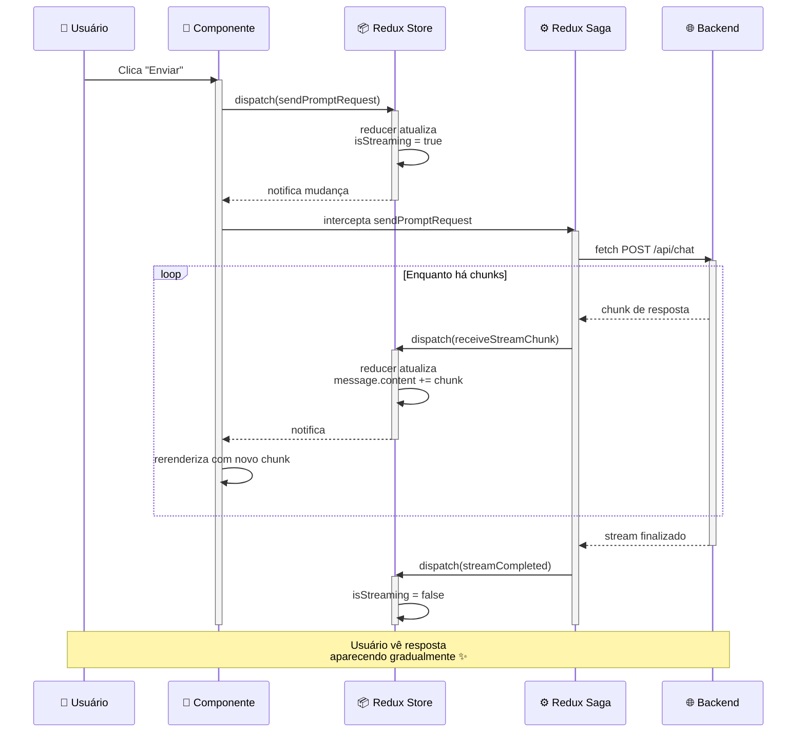

# 💬 Conversational APP - Bootcamp Project

interface de chat desenvolvido em React Native com Expo, implementando arquitetura Flux com Redux e Redux Sagas. O app permite enviar mensagens para uma IA e receber respostas em tempo real via streaming.

## 📋 Sumário

- [Visão Geral](#visão-geral)
- [Casos de Uso](#casos-de-uso)
- [Arquitetura Flux](#arquitetura-flux)
- [Tecnologias Utilizadas](#tecnologias-utilizadas)
- [Funcionalidades](#funcionalidades)
- [Explicação: Streaming de Respostas](#explicação-streaming-de-respostas)
- [Diagrama de sequência](#diagrama-de-sequencia)
- [Estrutura de Pastas](#estrutura-de-pastas)
- [Guia de Implementação](#guia-de-implementação)
- [Design (Figma)](#design-figma)
- [Referências](#referências)

---

## 🎯 Visão Geral

**Chat IA** é uma aplicação mobile que permite aos usuários:
- Conversar com uma IA por meio de mensagens de texto
- Receber respostas em tempo real (streaming)
- Cancelar respostas em andamento

**Stack:** Expo + React Native + Redux + Redux Sagas
**Plataforma:** iOS e Android

---

## 📱 Casos de Uso

### UC-01: Enviar Mensagem para IA

**Ator:** Usuário
**Pré-condição:** App aberto na tela de chat

**Fluxo Principal:**
1. Usuário digita mensagem no campo de input
2. Usuário clica no botão "Enviar"
3. App envia mensagem para a IA
4. IA começa a processar
5. Resposta começa a chegar em tempo real (streaming)
6. Mensagens são exibidas parcialmente conforme chegam
7. Fluxo finaliza quando a IA termina a resposta

**Fluxo Alternativo (Cancelamento):**
- Em qualquer momento do streaming, usuário clica "Stop"
- Conexão é abortada
- Resposta parcial é mantida na tela
- App volta ao estado de "pronto para nova mensagem"

---

### UC-02: Visualizar Histórico de Chat

**Ator:** Usuário
**Pré-condição:** Há mensagens no chat

**Fluxo Principal:**
1. Usuário vê lista de mensagens ordenadas cronologicamente
2. Mensagens do usuário aparecem à direita
3. Mensagens da IA aparecem à esquerda
4. Scroll automático para última mensagem

---

### UC-03: Parar Resposta em Andamento

**Ator:** Usuário
**Pré-condição:** IA está processando/streaming

**Fluxo Principal:**
1. Usuário visualiza botão "⏹ Stop" (vermelho)
2. Clica no botão
3. Conexão HTTP é abortada
4. Resposta parcial é mantida
5. Botão volta a ser "Enviar"

---

## 🏗️ Arquitetura Flux

### O que é Flux?

Flux é um **padrão de arquitetura** para gerenciar estado em aplicações. É unidirecional, o que significa que o fluxo de dados segue uma única direção:

User Interaction → Action → Dispatcher → Store → View


### Implementação com Redux

Redux é a implementação mais popular do padrão Flux. Seus componentes:

#### **1. Actions**
Descrições do que aconteceu.

```typescript
// Exemplo
{
  type: 'SEND_PROMPT_REQUEST',
  payload: 'Olá, como você está?'
}
```

#### **2. Reducers**
Funções puras que transformam estado com base em actions.

```typescript
const chatReducer = (state = initialState, action) => {
  switch(action.type) {
    case 'SEND_PROMPT_REQUEST':
      return { ...state, isLoading: true };
    default:
      return state;
  }
};
```

#### **3. Store**
Centraliza todo o estado da aplicação.

```typescript
const store = createStore(rootReducer);
```

#### **4. Middleware (Redux Sagas)**
Lida com side effects (requisições HTTP, temporizadores, etc.).

```typescript
function* sendPromptSaga(action) {
  // Chamadas assíncronas
  const response = yield call(api.chat, action.payload);
  yield put({ type: 'SEND_PROMPT_SUCCESS', payload: response });
}
```

### Fluxo de Dados

```
┌─────────────┐
│ User Click  │ (Clica em "Enviar")
└──────┬──────┘
       │
       ↓
┌──────────────────────────────────┐
│  Dispatch Action                 │
│  sendPromptRequest('Olá')        │
└──────┬───────────────────────────┘
       │
       ↓
┌──────────────────────────────────┐
│  Reducer                         │
│  Atualiza state.isLoading = true │
└──────┬───────────────────────────┘
       │
       ↓
┌──────────────────────────────────┐
│  Redux Saga Middleware           │
│  Intercepta action               │
│  Faz chamada HTTP                │
│  Abre streaming                  │
└──────┬───────────────────────────┘
       │
       ↓ (Chunks de resposta)
┌──────────────────────────────────┐
│  Dispatch Ações de Atualização   │
│  receiveStreamChunk(...)         │
└──────┬───────────────────────────┘
       │
       ↓
┌──────────────────────────────────┐
│  Reducer Atualiza State          │
│  Acrescenta conteúdo à mensagem  │
└──────┬───────────────────────────┘
       │
       ↓
┌──────────────────────────────────┐
│  Component Rerenderiza           │
│  Exibe resposta parcial          │
└──────────────────────────────────┘
```

## 🛠️ Tecnologias Utilizadas

### Expo
- React Native framework
- CLI para desenvolvimento e build
- Gerenciamento de assets

### Redux
- State Management
- Centralização de estado
- DevTools para debugging

### Redux Sagas
- Middleware para side effects
- Gerenciamento de fluxos assíncronos
- Cancelamento de operações (race/take)

### React Navigation (Expo)
- Navegação entre telas

### Axios
- Cliente HTTP com melhor controle

## ✨ Funcionalidades

- [ ] Tela de Chat - Exibe histórico de mensagens
- [ ] Input de Mensagem - Campo para digitar
- [ ] Enviar Mensagem - Integração com IA
- [ ] Streaming de Resposta - Respostas em tempo real
- [ ] Botão Stop - Parar resposta em andamento
- [ ] Loading State - Feedback visual durante streaming

## 🌊 Streaming de Respostas

### O Problema

Sem streaming, a aplicação funcionaria assim:

```
Usuário envia: "Conte uma história longa"
     │
     ↓
Backend processa (pode levar 10-30 segundos)
     │
     ↓
Usuário vê: ⏳ Carregando...
     │
     ↓
Finaliza processamento
     │
     ↓
Resposta completa aparece de repente
```

Problema: Usuário fica esperando, não sabe se app travou, experiência ruim.

### A Solução: Streaming
Com streaming, a resposta chega aos poucos:

```
Usuário envia: "Conte uma história longa"
     │
     ↓
Backend começa a processar e enviar parcialmente
     │
     ├─→ "Era uma vez..." (1º chunk)
     │
     ├─→ " um príncipe..." (2º chunk)
     │
     ├─→ " que viajava..." (3º chunk)
     │
     └─→ " pelo mundo." (último chunk)
     │
     ↓
Usuário vê resposta aparecer gradualmente
(Muito mais satisfatório! - UX)
```
### Como Funciona no Código

```typescript
// 1. Abrir conexão streaming
const response = await fetch('/api/chat', {
  method: 'POST',
  body: JSON.stringify({ prompt }),
  signal: abortController.signal, // Permite abortar
});

// 2. Ler chunks
const reader = response.body?.getReader();
const decoder = new TextDecoder();

while (true) {
  const { done, value } = await reader.read();

  if (done) break; // Fim do stream

  // 3. Decodificar chunk
  const chunk = decoder.decode(value, { stream: true });

  // 4. Dispatch ação para atualizar UI
  dispatch(receiveStreamChunk({
    messageId: lastMessageId,
    chunk: chunk
  }));
}
```

### Vantagens do Streaming

✅ UX Melhor - Resposta aparece gradualmente<br/>
✅ Feedback Imediato - Usuário vê que algo está acontecendo<br/>
✅ Cancelamento - Pode parar a qualquer momento<br/>
✅ Uso de Banda - Dados chegam conforme processados<br/>
✅ Menos Timeout - Não aguarda resposta completa<br/>

## 🔄 Diagrama de sequência



## 📁 Estrutura de Pastas

```
conversational-app/
│
├── 📄 README.md
├── 📄 package.json
├── 📄 app.json
├── 📄 tsconfig.json
├── 📄 .env.example
│
│
├── 📂 store/ (Redux + Sagas)
│   ├── 📂 slices/
│   │   └── chatSlice.ts (Reducer + Actions)
│   │
│   ├── 📂 sagas/
│   │   ├── chatSagas.ts (Sagas orquestrador)
│   │   ├── sendPromptSaga.ts (Enviar prompt)
│   │   └── stopStreamSaga.ts (Parar stream)
│   │
│   ├── 📂 types/
│   │   └── chat.ts (Tipos do Redux)
│   │
│   └── index.ts (Configuração da Store)
│
├── 📂 app/ (navigation screens)
│   └── 📂 (tabs)/
│       └── index.tsx (ChatScreen)
|       └── settings.tsx
│
├── 📂 components/ (Componentes reutilizáveis)
│   └── 📂 AgentComponents/ (Componentes disponíveis para a Resposta do Agente de IA)
|   |   └── AgentComponentRenderer.tsx (Renderiza a lista de componentes retornada pelo Agente)
|   |   ├── TextH1.tsx
|   |   ├── Paragraph.tsx
|   |   └── TextList.tsx
│   ├──── ChatInput.tsx
│   └──── ChatUserMessage.tsx
│
├── 📂 api/ (Requisições HTTP)
│   └── chatAPI.ts (Fetch com streaming)
│
├── 📂 __tests__/ (Testes)
│   ├── slices/
│   │   └── chatSlice.test.ts
│   ├── sagas/
│   │   └── chatSagas.test.ts
│   └── components/
│       └── ChatMessage.test.tsx
└──
```

## 🚀 Iniciando o projeto

```bash
# ADICIONE O ARQUIVO .env

# INICIE O SERVIDOR DE TESTES
cd server-example
npm install
node server.js

# NA RAIZ DO REPOSITORIO RODE OS COMANDOS
npm install
npm run ios #or npm run android

npm run start
```

## 🎨 Design (Figma)

O design da aplicação foi criado no Figma. Acesse para ver a interface:

[Abrir Design no Figma](https://www.figma.com/design/HEDqG4dImbyM4KYWJbwbOK/Bootcamp---P-D-Utimatum?node-id=1002-11480&t=ExX8yhtqJ5kuZ8Wg-1)

### Componentes Visuais

- Chat IA - 1, 2, 3: Diferentes estados da tela
- Header: Logo + Título
- Message Bubbles: Mensagens do usuário (a direita) e IA (a esquerda)
- Input Group: Campo de texto + Botões
- Loading State: Indicador de streaming
- Error State: Mensagem de erro

## 📚 Referências

- [Arquitetura Flux](https://facebookarchive.github.io/flux/)
- [React Native CleanArch](https://medium.com/@sharmapraveen91/clean-architecture-in-react-native-beyond-the-basics-c5894e6a78c7)
- [Pure Functions](https://www.freecodecamp.org/news/what-is-a-pure-function-in-javascript-acb887375dfe)
- [React Native Official](https://reactnative.dev/)
- [Expo Docs](https://docs.expo.dev/)
- [Redux Toolkit](https://redux-toolkit.js.org/)
- [Redux Saga](https://redux-saga.js.org/)
